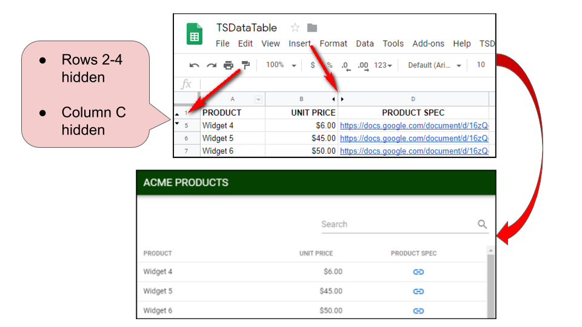
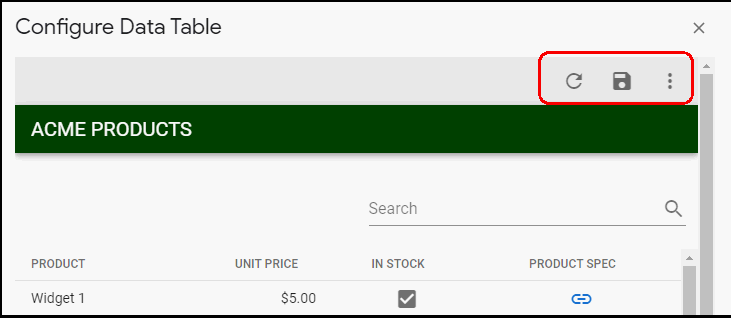
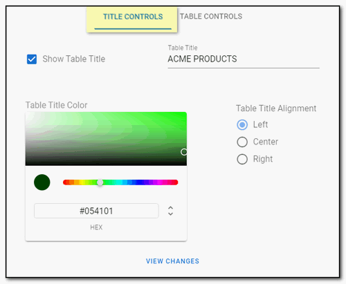
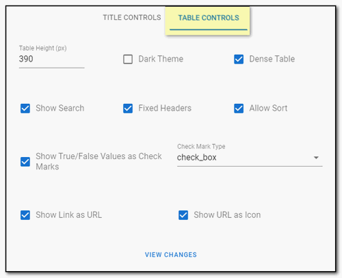

# TSDataTable

**TSDataTable** is a simple, elegant data table publishing tool for Google Sheets &amp; Sites.  

**TSDataTable** employs [Google Apps Script](https://developers.google.com/apps-script) inside a [Google Sheet](https://www.google.com/sheets/about/) to retrieve data from the *first sheet*, filter the data based on hidden rows and columns, cache the data to speed loading and display data in a nicely formatted, paginated and searchable data table. 

**TSDataTable** display options are configurable and the resulting site can be standalone or embedded in [Google Sites](https://medium.com/r/?url=https%3A%2F%2Fgsuite.google.com%2Fproducts%2Fsites%2F).

**TSDataTable** is intended for data table publishing within a [G Suite for Business](https://gsuite.google.com/solutions/) or [G Suite for Education](https://edu.google.com/products/gsuite-for-education) domain.

---

## Getting Started

### Installation

* Login to [Google Drive](https://drive.google.com/)

* Access TSDataTable

* Click the ***Make a copy*** button. _This will copy the **TSDataTable** host Google Sheet to your Google Drive._

### Table Data

**TSDataTable** retrieves data from the *first sheet* of the Google Sheet and uses the *first* row of data as the **table column headings** in the resulting table display.  

To add, delete or change the order of the table data columns or rows [add, delete or move columns/rows](https://support.google.com/docs/answer/54813) in Google Sheets.

*If you would like to display another sheet of data, move that sheet to the first position in the Google Spreadsheet and clear the data cache using the table configuration options (see instructions below).*

### Data Table Column Alignment

To align data in the table columns, [align](https://support.google.com/docs/answer/46973) the corresponding column header in the *first row* of the Google Sheet. 

### Hide Table Data

To remove data columns or rows in the table view, [hide](https://support.google.com/docs/answer/9060449) the corresponding columns or rows in Google Sheets and reload the table.  

### Configuration

**TSDataTable** configuration is accessed through the host Google Sheet menu ***TSDataTable*** → ***Configure Data Table***.

:exclamation: *The first time the __TSDataTable__ menu is accessed, the script will prompt for __authorization__. Complete the authorization process by following the Google authorization prompts.*

### Configure Data Table

* To open the table title and table display configuration, click the **options** icon at the top right.  
* To save configuration changes, click the **save** icon.  
* To reload data or configuration changes, click the **reload** icon.

### Configure Table Title

Configure the table title display under the **Title Controls** tab.

| # | OPTION | DESCRIPTION |
|-| ---- | --------- |
| 1 | Show Table Title | Enable/Disable table title bar display |
| 2 | Table Title | Edit table title.  *(The initial table title defaults to the name of the Google Spreadsheet.)* |
| 3 | Table Title Color | Set table title bar background color. |
| 4 | Table Title Alignment | Align of table title within title bar *(left, center, right)*. |
| 5 | View Changes | Close configuration dialog to view configuration changes. |

### Configure Table Display

Configure the table display under the **Table Controls** tab.

| # | OPTION | DESCRIPTION |
|-| ---- | --------- |
| 1 | Table Height (px)| Set the height of the table display *(measurement in pixels)*. |
| 2 | Dark Theme | Apply a dark theme to the table display. |
| 3 | Dense Table | Decrease the height of the table data rows. |
| 4 | Show Search | Enable/Disable the table search feature. |
| 5 | Fixed Headers | Fix table column headers to top of table when scrolling. *__NOTE:__ This does not work in IE11 browsers.* |
| 6 | Allow Sort | Enable/Disable sorting on table column data.  *__NOTE:__ Data sorting is alphanumeric.* |
| 7 | Show True/False Values as Check Marks | Enable/Disable showing True/False values in Google Sheet as check marks.  *Especially useful if using [Google Sheet checkboxes](https://support.google.com/docs/answer/7684717).  If value is TRUE a check mark will show, otherwise the field will be blank.* |
| 8 | Check Mark Type | Determine the type of check mark icon which displays when value is TRUE.  *__NOTE:__  Option 7 must be enabled to set the check mark type.* |
| 9 | Show Link as URL | Enable/Disable http or https links displaying as active URLs. |
| 10 | Show URL as Icon | Turn http or https URLs into a linked icon vs. the actual full URL.  *__NOTE:__  Option 9 must be enabled to set the URL to an icon.* |
| 11 | View Changes | Close configuration dialog to view configuration changes. |

### Publish Data Table

To publish a data table as a web application:

* Open the **Script Editor** in the host **TSDataTable** Google Sheet via the ***Tools*** → ***<> Script Editor*** menu.

* Follow the steps in [Deploying a script as a web app](https://developers.google.com/apps-script/guides/web#deploying_a_script_as_a_web_app) with the following changes:
  * Under ***Execute the app as:*** → select your account
  * Under ***Who has access to the app:*** → select ***Anyone within "your domain"***
  
To access the published data table, use the URL from ***Current web app URL*** section of the publishing dialog aboes *(URL that ends in `/exec`)*.  Also use this URL to embed the published data table in a Google Site *(see next section)*.

### Embed Published Data Table in a Google Site

Once the data table has been published it can be embedded in the ***new*** version of Google Sites.  Follow the instructions [adding content from another website](https://support.google.com/sites/answer/90569) on the Google Sites documentation.  

*__TIP!__ By controlling the size of the embed area in the Google Site, you can control additional viewing of the data table.*

---

## Important Notes

* **TSDataTable** is intended for internal use within a [G Suite for Business](https://gsuite.google.com/solutions/) or [G Suite for Education](https://edu.google.com/products/gsuite-for-education) domain.

* **TSDataTable** caches data for up to 6 hours to speed table display.  When the cache expires the table data will be retrieved once again and the cache repopulated.  The cache can be manually cleared prior to the 6 hours expiration to pick up new data and table configuration changes.

* **TSDataTable** is not meant to be used with large data sets.  If you receive errors for exceeding the cache quota or the table takes to long to load, you may need a more robust solution like [App Maker](https://developers.google.com/appmaker/).

* **TSDataTable** may not display all sheet data (e.g. [cell images](https://support.google.com/docs/answer/9224754)).

* **TSDataTable** works with the ***new*** version of Google Sites.

---

## Credits

* [Vue.js](https://vuejs.org) - Progressive Javascript Framework

* [Vuetify](https://vuetifyjs.com) - Material Design Component Framework

---

## License

**TSDataTable License**

© Laura Taylor ([github.com/techstreams](https://github.com/techstreams)). Licensed under an MIT license.

Permission is hereby granted, free of charge, to any person obtaining a copy of this software and associated documentation files (the "Software"), to deal in the Software without restriction, including without limitation the rights to use, copy, modify, merge, publish, distribute, sublicense, and/or sell copies of the Software, and to permit persons to whom the Software is furnished to do so, subject to the following conditions:

The above copyright notice and this permission notice shall be included in all copies or substantial portions of the Software.

THE SOFTWARE IS PROVIDED "AS IS", WITHOUT WARRANTY OF ANY KIND, EXPRESS OR IMPLIED, INCLUDING BUT NOT LIMITED TO THE WARRANTIES OF MERCHANTABILITY, FITNESS FOR A PARTICULAR PURPOSE AND NONINFRINGEMENT. IN NO EVENT SHALL THE AUTHORS OR COPYRIGHT HOLDERS BE LIABLE FOR ANY CLAIM, DAMAGES OR OTHER LIABILITY, WHETHER IN AN ACTION OF CONTRACT, TORT OR OTHERWISE, ARISING FROM, OUT OF OR IN CONNECTION WITH THE SOFTWARE OR THE USE OR OTHER DEALINGS IN THE SOFTWARE.

